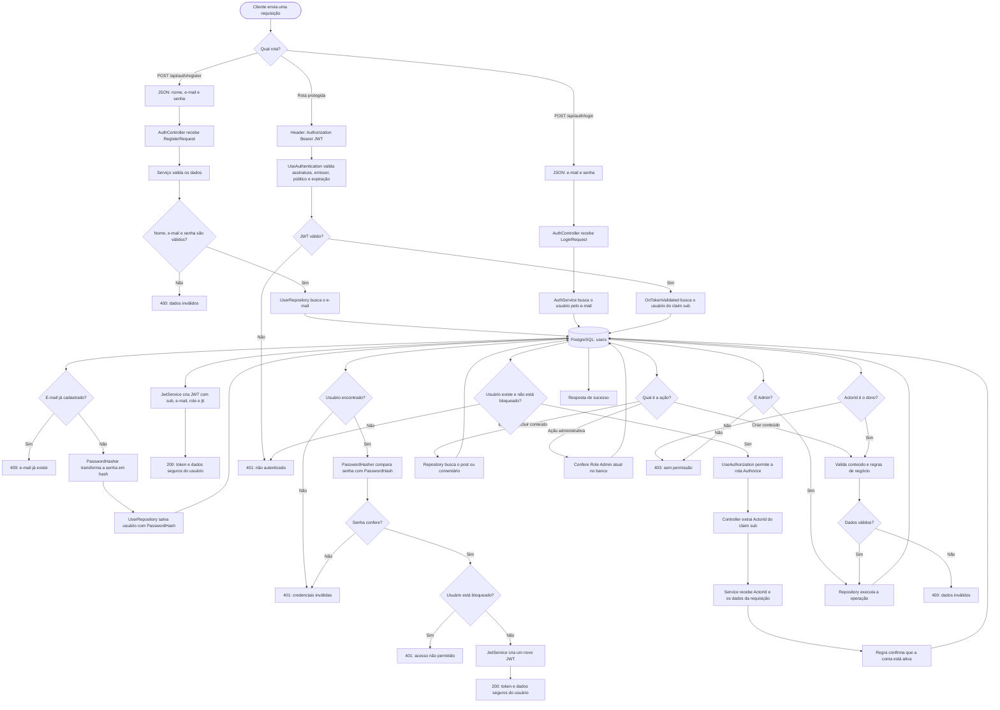

# Pudd — autenticação e autorização

O diagrama abaixo mostra o caminho real dos dados no backend: do cadastro ou login até uma ação protegida, como criar, editar ou excluir uma postagem.

Pontos importantes:

- A senha original nunca é salva no banco: apenas o `PasswordHash`.
- O JWT não guarda a senha. Ele leva dados de identificação, principalmente o `sub`, que é o ID do usuário.
- `ActorId` é o ID obtido do `sub`; ele identifica quem está tentando executar a ação.
- A autorização não confia somente no token: em cada requisição protegida, a API também verifica no banco se o usuário ainda existe e não está bloqueado.
- Em ações sobre conteúdo próprio, o service compara `ActorId` com o `UserID` do post ou comentário. Em ações de administração, ele confirma o cargo atual no banco.
