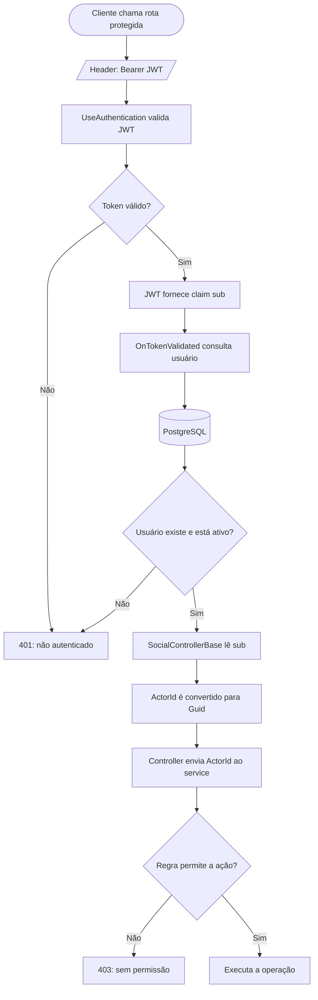

# Pudd — fluxo do ActorId

`ActorId` é o ID de quem fez a requisição. Ele não vem do corpo enviado pelo cliente: a API o extrai do JWT já validado.

O service usa o `ActorId` para validar conta ativa, dono do conteúdo ou cargo de Admin.
