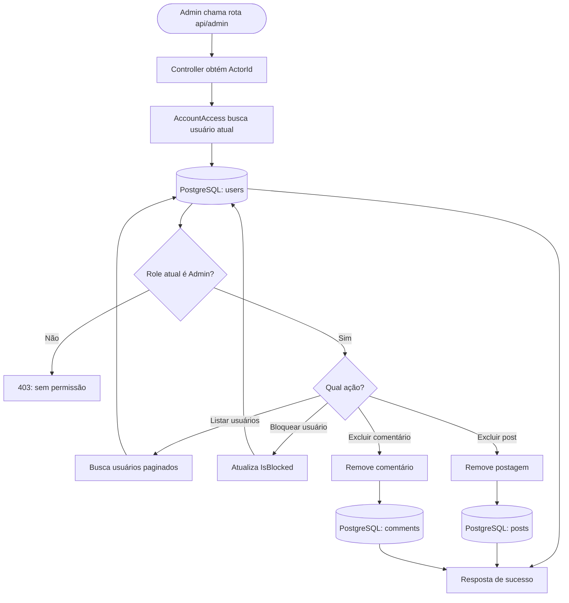

# Pudd — fluxo de administração

```mermaid
flowchart TD
    start([Admin chama rota api/admin]) --> actor[Controller obtém ActorId]
    actor --> findUser[AccountAccess busca usuário atual]
    findUser --> users[(PostgreSQL: users)]
    users --> isAdmin{Role atual é Admin?}
    isAdmin -->|Não| forbidden[403: sem permissão]
    isAdmin -->|Sim| action{Qual ação?}
    action -->|Listar usuários| list[Busca usuários paginados]
    action -->|Bloquear usuário| block[Atualiza IsBlocked]
    action -->|Excluir post| deletePost[Remove postagem]
    action -->|Excluir comentário| deleteComment[Remove comentário]
    list --> users
    block --> users
    deletePost --> posts[(PostgreSQL: posts)]
    deleteComment --> comments[(PostgreSQL: comments)]
    users --> response[Resposta de sucesso]
    posts --> response
    comments --> response
```

O cargo é conferido no PostgreSQL, não apenas no JWT. Assim, se o cargo mudar, um token antigo não mantém privilégios de Admin.
