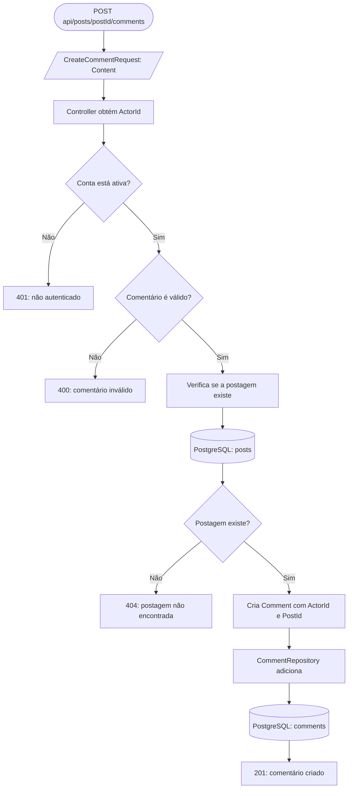
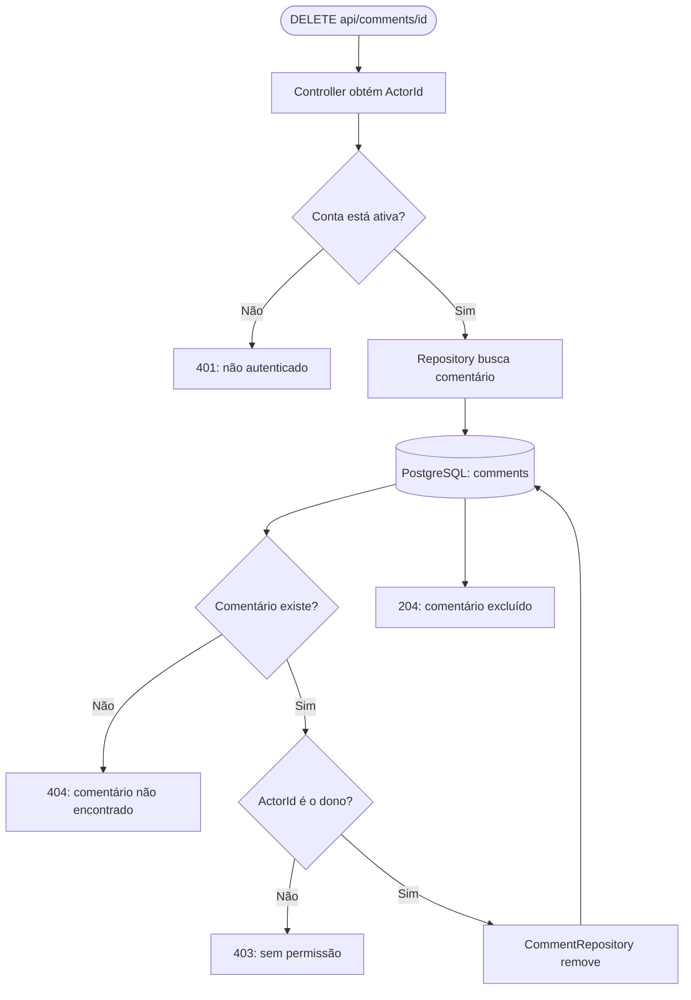

# Pudd — fluxo de comentários

## Criar comentário

```mermaid
flowchart TD
    start([POST api/posts/postId/comments]) --> input[/CreateCommentRequest: Content/]
    input --> actor[Controller obtém ActorId]
    actor --> active{Conta está ativa?}
    active -->|Não| unauthorized[401: não autenticado]
    active -->|Sim| content{Comentário é válido?}
    content -->|Não| invalid[400: comentário inválido]
    content -->|Sim| findPost[Verifica se a postagem existe]
    findPost --> database[(PostgreSQL: posts)]
    database --> exists{Postagem existe?}
    exists -->|Não| notFound[404: postagem não encontrada]
    exists -->|Sim| create[Cria Comment com ActorId e PostId]
    create --> repository[CommentRepository adiciona]
    repository --> comments[(PostgreSQL: comments)]
    comments --> created[201: comentário criado]
```

## Excluir comentário

```mermaid
flowchart TD
    start([DELETE api/comments/id]) --> actor[Controller obtém ActorId]
    actor --> active{Conta está ativa?}
    active -->|Não| unauthorized[401: não autenticado]
    active -->|Sim| findComment[Repository busca comentário]
    findComment --> database[(PostgreSQL: comments)]
    database --> exists{Comentário existe?}
    exists -->|Não| notFound[404: comentário não encontrado]
    exists -->|Sim| owner{ActorId é o dono?}
    owner -->|Não| forbidden[403: sem permissão]
    owner -->|Sim| delete[CommentRepository remove]
    delete --> database
    database --> success[204: comentário excluído]
```

O Admin também pode excluir comentários de outras pessoas; nesse caso, o service confirma o cargo de Admin no banco.
