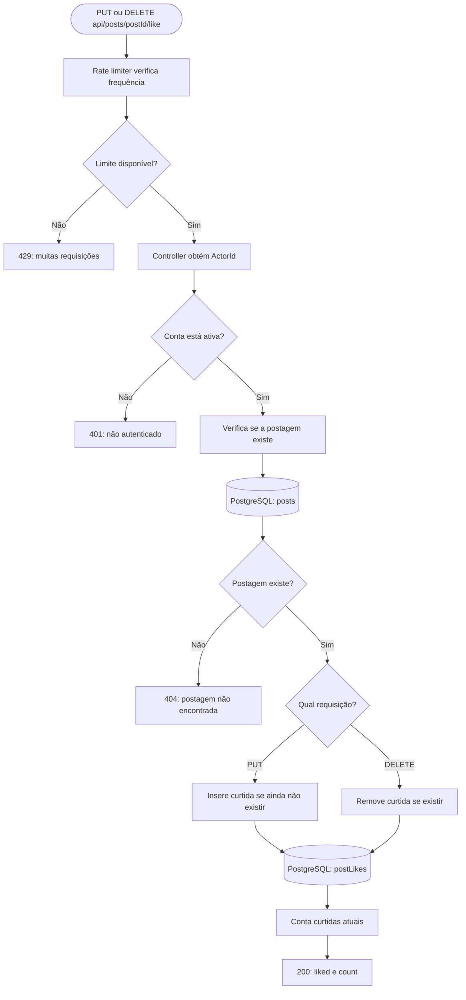

# Pudd — fluxo de curtidas

`PUT` significa “deixar curtido” e `DELETE` significa “deixar descurtido”. Repetir a mesma requisição não inverte o estado. O índice único `UserID + PostID` impede duas curtidas do mesmo usuário no mesmo post.
