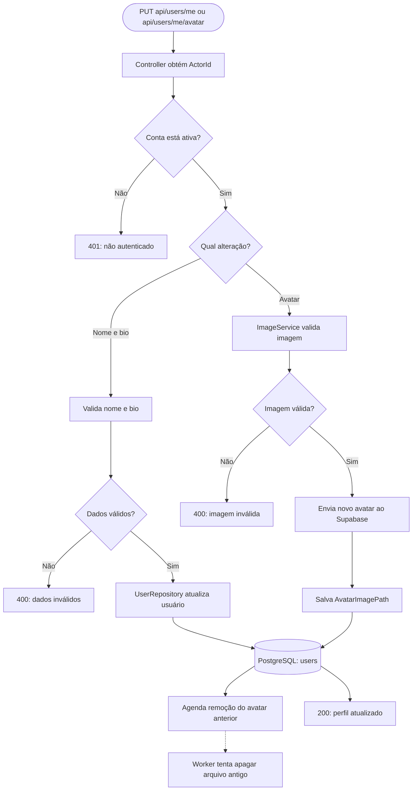

# Pudd — fluxo de perfil e avatar

```mermaid
flowchart TD
    start([PUT api/users/me ou api/users/me/avatar]) --> actor[Controller obtém ActorId]
    actor --> active{Conta está ativa?}
    active -->|Não| unauthorized[401: não autenticado]
    active -->|Sim| action{Qual alteração?}
    action -->|Nome e bio| validateProfile[Valida nome e bio]
    validateProfile --> profileValid{Dados válidos?}
    profileValid -->|Não| invalid[400: dados inválidos]
    profileValid -->|Sim| updateProfile[UserRepository atualiza usuário]
    updateProfile --> users[(PostgreSQL: users)]
    action -->|Avatar| validateImage[ImageService valida imagem]
    validateImage --> imageValid{Imagem válida?}
    imageValid -->|Não| invalidImage[400: imagem inválida]
    imageValid -->|Sim| upload[Envia novo avatar ao Supabase]
    upload --> savePath[Salva AvatarImagePath]
    savePath --> users
    users --> cleanup[Agenda remoção do avatar anterior]
    cleanup -.-> worker[Worker tenta apagar arquivo antigo]
    users --> success[200: perfil atualizado]
```

Para remover o avatar, `DELETE /api/users/me/avatar` deixa `AvatarImagePath` nulo e agenda a limpeza do arquivo antigo.
