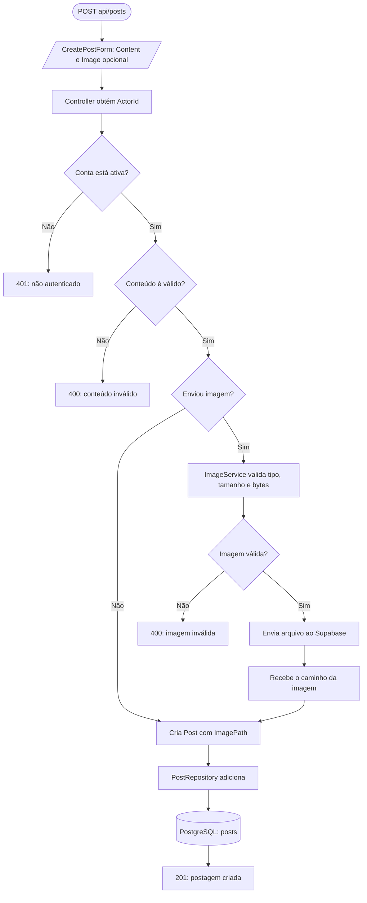
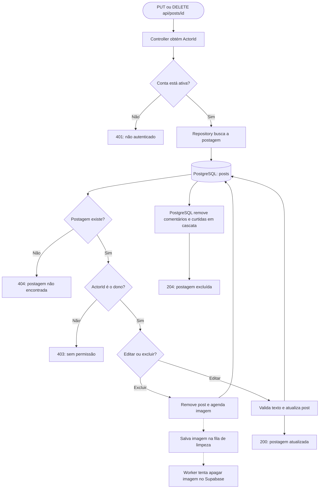

# Pudd — fluxo de postagens

## Criar postagem

## Editar ou excluir postagem

Na edição, o usuário pode manter, substituir ou remover a imagem. Não pode pedir para remover e substituir a imagem na mesma requisição.
