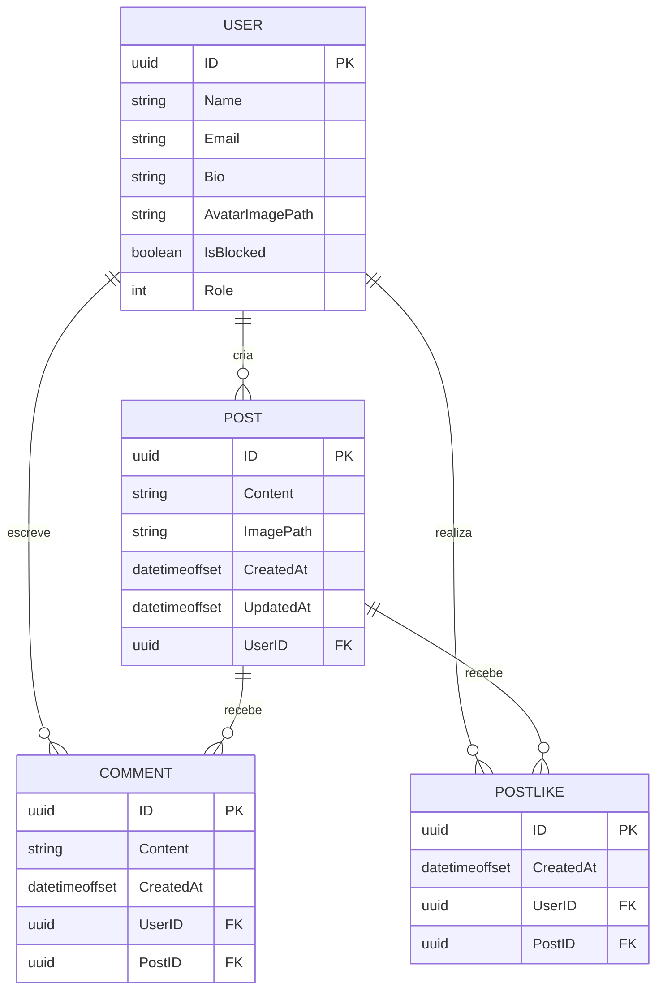
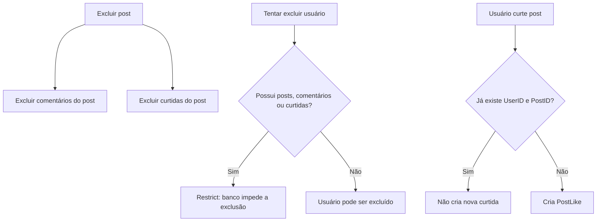

# Pudd — Postagens

## Modelo de dados

## Regras de relacionamento

- Um usuário pode criar nenhuma ou várias postagens.
- Cada postagem pertence a um único usuário.
- Um comentário pertence a um usuário e a uma postagem.
- A combinação `UserID + PostID` em `PostLike` é única: um usuário só pode curtir uma vez cada post.
- Ao excluir uma postagem, comentários e curtidas vinculados são removidos em cascata.
